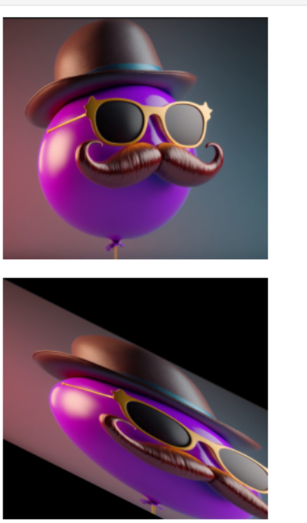

# Image-Transformation
## Aim
To perform image transformation such as Translation, Scaling, Shearing, Reflection, Rotation and Cropping using OpenCV and Python.

## Software Required:
Anaconda - Python 3.7

## Algorithm:
### Step1:
Import the required libraries and image for transformation.

### Step2:
Perform operations on the image like translaton, rotation and other.

### Step3:
Use the warpPerspective(image , matrix, (rows, columns)) function.

### Step4:
Plot the Image and Transformed Image on the graph using matplotlib for identifying changes.

### Step5:
Diifferent operations has been performed on the image.

## Program:
```
Developed By: M.Sowmya
Register Number:212221230107
```
### i)Image Translation:
```
import numpy as np
import cv2
import matplotlib.pyplot as plt
#read the input image
input_image=cv2.imread('dip5.png')
#Convert from BGR to RGB so we can plot using matplotlib
input_image=cv2.cvtColor(input_image,cv2.COLOR_BGR2RGB)
#Disable x & y axis
plt.axis('off')
#Show the image
plt.imshow(input_image)
plt.show()
#Get the image shape
rows,cols,dim=input_image.shape
M=np.float32([[1,0,100],
              [0,1,200],
              [0,0,1]])
translated_image=cv2.warpPerspective(input_image,M,(cols*2,rows*2))
plt.axis('off')
plt.imshow(translated_image)
plt.show()
```

### ii) Image Scaling:
```
## Scaling
import numpy as np
import cv2
import matplotlib.pyplot as plt
input_image=cv2.imread('dip5.png')
input_image=cv2.cvtColor(input_image,cv2.COLOR_BGR2RGB)
plt.axis('off')
plt.imshow(input_image)
plt.show()
rows,cols,dim=input_image.shape
M=np.float32([[1.5,0,0],
              [0,1.8,0],
              [0,0,1]])
scaled_image=cv2.warpPerspective(input_image,M,(cols*2,rows*2))
plt.axis('off')
plt.imshow(scaled_image)
plt.show()
```


### iii)Image shearing:
```
##shearing
import numpy as np
import cv2
import matplotlib.pyplot as plt
input_image=cv2.imread('dip5.png')
input_image=cv2.cvtColor(input_image,cv2.COLOR_BGR2RGB)
plt.axis('off')
plt.imshow(input_image)
plt.show()
rows,cols,dim=input_image.shape
M_x=np.float32([[2,1,0],
              [0,1,0],
              [0,0,1]])
M_y=np.float32([[2,0,0],
              [1,1,0],
              [0,0,1]])

shearing_image_x=cv2.warpPerspective(input_image,M_x,(int(cols*1.5),int(rows*1.5)))
shearing_image_y=cv2.warpPerspective(input_image,M_y,(int(cols*1.5),int(rows*1.5)))
plt.axis('off')
plt.imshow(shearing_image_x)
plt.imshow(shearing_image_y)
plt.show()
plt.show()
```


### iv)Image Reflection:
```
#Reflection
import numpy as np
import cv2
import matplotlib.pyplot as plt
input_image=cv2.imread('dip5.png')
input_image=cv2.cvtColor(input_image,cv2.COLOR_BGR2RGB)
plt.axis('off')
plt.imshow(input_image)
plt.show()
rows,cols,dim=input_image.shape
M_x=np.float32([[1,0,0],
              [0,-1,rows],
              [0,0,1]])
M_y=np.float32([[-1,0,cols],
              [0,1,0],
              [0,0,1]])
Reflected_image_x=cv2.warpPerspective(input_image,M_x,(int(cols),int(rows)))
Reflected_image_y=cv2.warpPerspective(input_image,M_y,(int(cols),int(rows)))
plt.axis('off')
plt.imshow(Reflected_image_x)
plt.imshow(Reflected_image_y)
plt.show()
plt.show()
```
### v)Image Rotation:
```
#rotation
import numpy as np
import cv2
import matplotlib.pyplot as plt
input_image=cv2.imread('dip5.png')
input_image=cv2.cvtColor(input_image,cv2.COLOR_BGR2RGB)
plt.axis('off')
plt.imshow(input_image)
plt.show()
rows,cols,dim=input_image.shape
#Angle froem degree to radian
angle=np.radians(25)
#Transformation matrix for Rotation
M=np.float32([[np.cos(angle),-(np.sin(angle)),0],
              [np.sin(angle),np.cos(angle),0],
              [0,0,1]])
Rotated_image=cv2.warpPerspective(input_image,M,(int(cols),int(rows)))
plt.axis('off')
plt.imshow(Rotated_image)
plt.show()
```
## Output:
### i)Image Translation


### ii) Image Scaling


### iii)Image shearing



### iv)Image Reflection


### v)Image Rotation


## Result: 

Thus the different image transformations such as Translation, Scaling, Shearing, Reflection, Rotation and Cropping are done using OpenCV and python programming.
